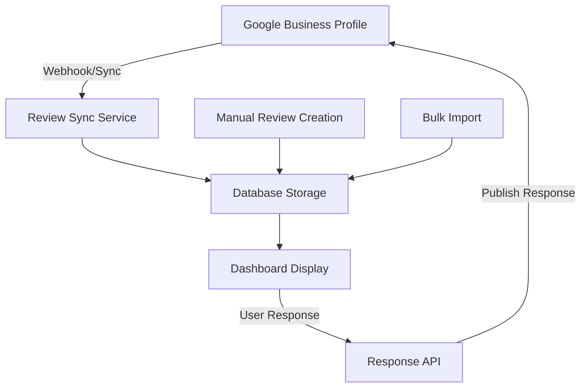
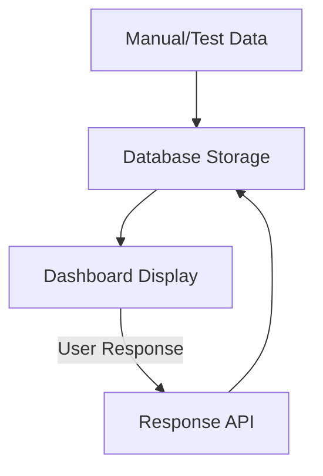

# Review Management Architecture

## Overview
The review management system is designed to handle reviews from Google Business Profile (GBP) while providing local database storage, response management, and analytics.

## Data Flow Architecture

### 1. Production Flow (With GBP Integration)


### 2. Current Development Flow


## Review Data Sources

### Primary Source: Google Business Profile API
- **Real Customer Reviews**: Actual reviews from Google customers
- **Automatic Sync**: Scheduled jobs fetch new reviews
- **Webhook Integration**: Real-time notifications for new reviews
- **Response Publishing**: Responses written in dashboard get published to Google

### Secondary Source: Manual/Import
- **Test Data**: For development and testing
- **Historical Data**: Imported from other systems
- **Backup/Offline**: When API is unavailable

## Database Schema

### Review Table
```sql
CREATE TABLE reviews (
  id                VARCHAR PRIMARY KEY,
  google_review_id  VARCHAR UNIQUE,     -- From GBP API
  business_profile_id VARCHAR NOT NULL,
  reviewer_name     VARCHAR NOT NULL,
  reviewer_photo_url VARCHAR,
  rating           INTEGER NOT NULL,
  content          TEXT,
  published_at     TIMESTAMP NOT NULL,
  status           review_status DEFAULT 'NEW',
  sentiment        review_sentiment DEFAULT 'NEUTRAL',
  is_verified      BOOLEAN DEFAULT false,
  created_at       TIMESTAMP DEFAULT NOW(),
  updated_at       TIMESTAMP DEFAULT NOW()
);
```

### Response Table
```sql
CREATE TABLE review_responses (
  id           VARCHAR PRIMARY KEY,
  review_id    VARCHAR UNIQUE REFERENCES reviews(id),
  content      TEXT NOT NULL,
  published_at TIMESTAMP DEFAULT NOW(),
  created_by   VARCHAR REFERENCES users(id),
  created_at   TIMESTAMP DEFAULT NOW(),
  updated_at   TIMESTAMP DEFAULT NOW()
);
```

## Integration Components

### 1. Google Business Profile API Integration
```typescript
// Service for syncing reviews from GBP
class GBPReviewService {
  async syncReviews(businessProfileId: string) {
    const gbpReviews = await this.gbpClient.getReviews(businessProfileId);
    
    for (const gbpReview of gbpReviews) {
      await this.syncSingleReview(gbpReview);
    }
  }
  
  async publishResponse(reviewId: string, content: string) {
    // Publish response back to Google Business Profile
    return await this.gbpClient.createReviewReply(reviewId, content);
  }
}
```

### 2. Webhook Handler
```typescript
// Webhook endpoint for real-time review notifications
export async function POST(request: NextRequest) {
  const webhook = await request.json();
  
  if (webhook.type === 'review.created') {
    await syncNewReview(webhook.data.reviewId);
    await sendNotification(webhook.data);
  }
}
```

### 3. Sync Scheduler
```typescript
// Scheduled job to sync reviews regularly
import cron from 'node-cron';

// Sync every hour
cron.schedule('0 * * * *', async () => {
  const businesses = await getActiveBusinessProfiles();
  
  for (const business of businesses) {
    await gbpService.syncReviews(business.googleBusinessId);
  }
});
```

## Response Management

### Response Flow
1. **User writes response** in dashboard
2. **Store in database** with pending status
3. **Publish to Google** via GBP API
4. **Update status** to published
5. **Log activity** for audit trail

### Response Types
- **Public Responses**: Published to Google (visible to all)
- **Internal Notes**: Stored locally (team communication)
- **Automated Responses**: AI-generated suggestions

## Current Implementation Status

### ✅ Completed
- Database schema and models
- Dashboard UI for review management
- Response creation and management
- Filtering and search functionality
- Statistics and analytics
- Template management system

### 🔄 In Development
- Google Business Profile API integration
- Webhook handling for real-time sync
- Automated response publishing
- Notification system

### 📋 Planned
- AI-powered sentiment analysis
- Automated response suggestions
- Bulk response operations
- Review trend analytics
- Performance reporting

## Environment Configuration

### Required API Credentials
```env
# Google Business Profile API
GOOGLE_CLIENT_ID=your_client_id
GOOGLE_CLIENT_SECRET=your_client_secret
GOOGLE_REFRESH_TOKEN=your_refresh_token

# Webhook Configuration
WEBHOOK_SECRET=your_webhook_secret
WEBHOOK_URL=https://yourapp.com/api/webhooks/reviews
```

### Rate Limiting
- **GBP API**: 100 requests per 100 seconds per user
- **Sync Frequency**: Every 15 minutes for active businesses
- **Batch Size**: 50 reviews per request

## Testing Strategy

### Development Data
- Use test reviews in database for UI development
- Mock GBP API responses for integration testing
- Sample data for performance testing

### Staging Environment
- Connect to Google My Business test accounts
- Simulate webhook events
- Test response publishing flow

### Production Monitoring
- API rate limit monitoring
- Sync success/failure tracking
- Response publication status
- User activity logging 